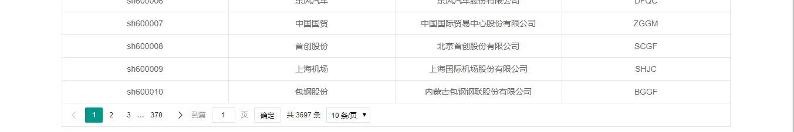
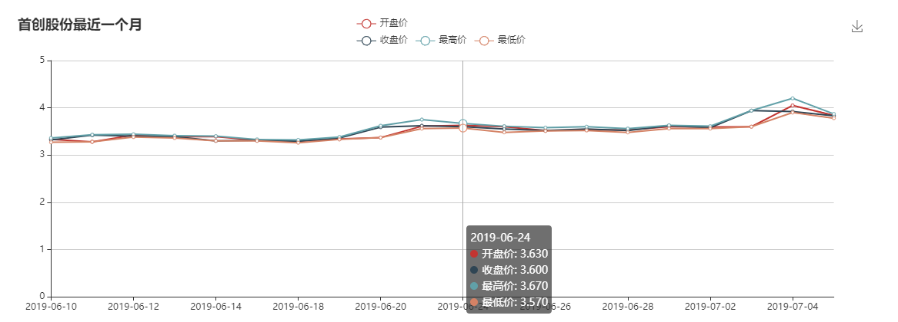
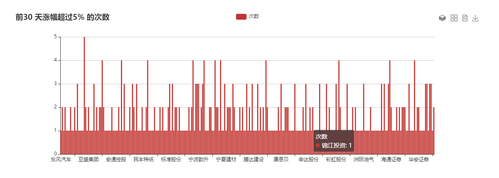

提示：我们十分欢迎您的参与！如果您有任何反馈，可以再[CSDN](https://blog.csdn.net/weixin_43125410)给我留言。
# StockSpark（股票信息网）
StockSpark是股票信息查询和展示网站，后端通过springboot、Jsoup、mybaits来实现股票信息的爬取、加入数据库、job定时器等功能。前端采用[layui](https://www.layui.com/)结合Thmeleaf模板引擎开发界面，数据图表展示选用的[百度echarts](https://echarts.baidu.com/)


主要功能包含：

  - 股票信息的爬取、查看股票、查看股票历史行情、查看股票近一月的情况、查看所有股票30天内涨幅超过5%的次数
  
## 安装部署
* 克隆到本地[git@github.com:phyear/StockSpark.git](git@github.com:phyear/StockSpark.git)或者下载到本地
* idea导入项目
* 导入mysql数据库
* 修改application.properties文件中数据源信息，改为自己的密码和用户

  ```
  spring.datasource.driver-class-name=com.mysql.jdbc.Driver
  spring.datasource.url=jdbc:mysql://localhost:3306/shares?useUnicode=true&characterEncoding=UTF8&serverTimezone=UTC&useSSL=false
  spring.datasource.username=自己用户名
  spring.datasource.password=自己密码
  ```
  
## 页面展示
  * 股票代码信息界面
  
  
  
  * 股票详情
  
  
  
  * 涨幅情况
  


## 支持

如果您有任何问题，需要我们的支持，[可以通过这些方式联系我们](https://blog.csdn.net/weixin_43125410)。
